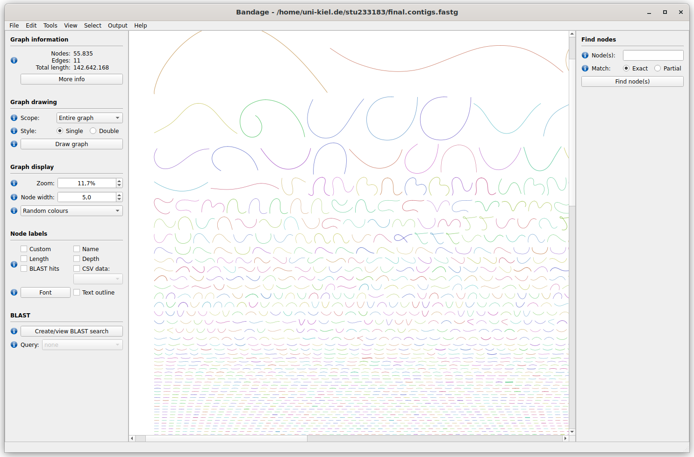
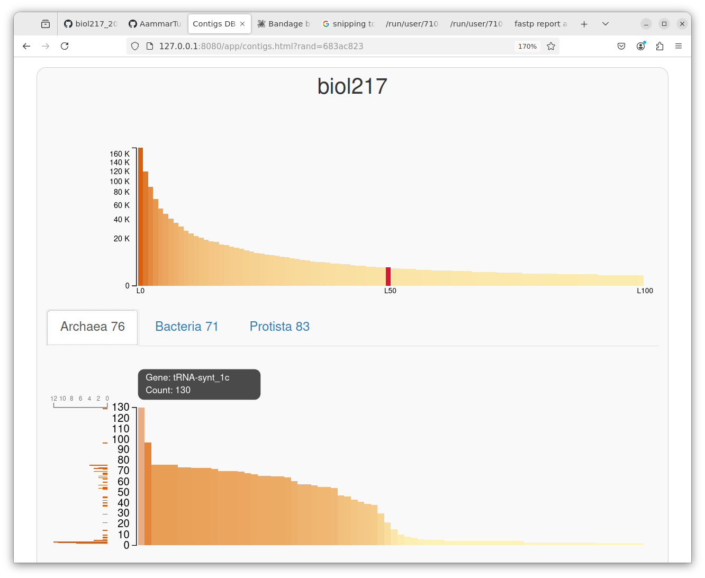

# Protocol Day3
## Mattes Schultze
### 22.01.2025

Number of total contigs: 55835

afterwards, the quality was assessed with quast

N50 value: 3014
Contigs assembled: 55835
Total length: 142642168

Afterwards, we did a bunch of stuff with the gole of genome binning

first: Mapping, convert the output of the assembly visualization, the final contig file, to a fasta format

then, and index of the contig file is made with bowtie2-build

afterwards, the cleaned reads, the fastp output, is mapped, with bowtie2

the result, a map, is then converted from a .sam to a .bam format

the contig files are then prepared for binning with anvio, resulting in a contig.db file

in the directory containing this file, a special server can be accessed via the tutorial found in the github folder

there we can see the following graph

afterwards, we did binning with metabat maxbin2

Number of Archaea according to metabat: 3

Number of Archaea according to maxbin2: 1

METABAT2: archaewa percent completing 98.6, redundancy 2.63, matching domain 1

