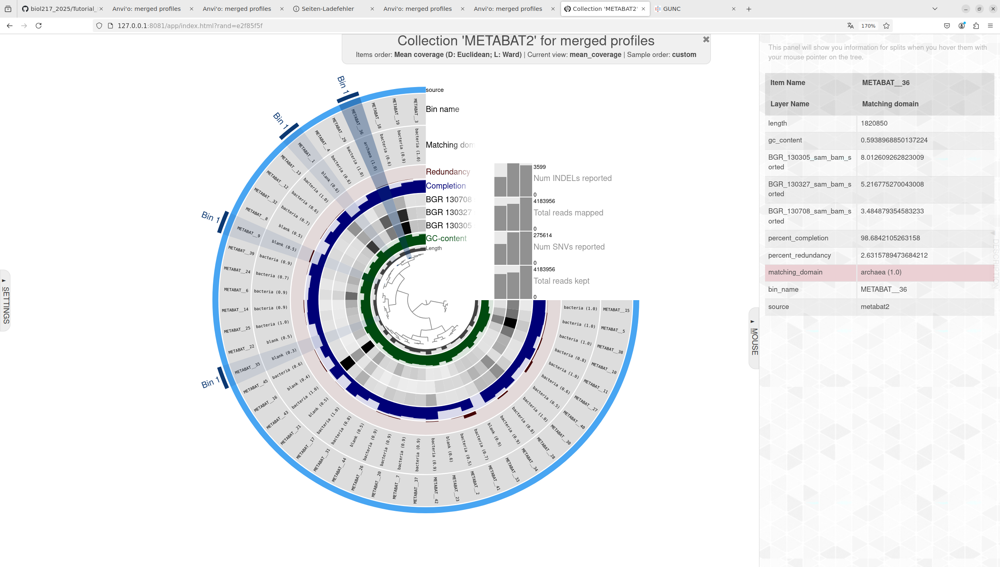
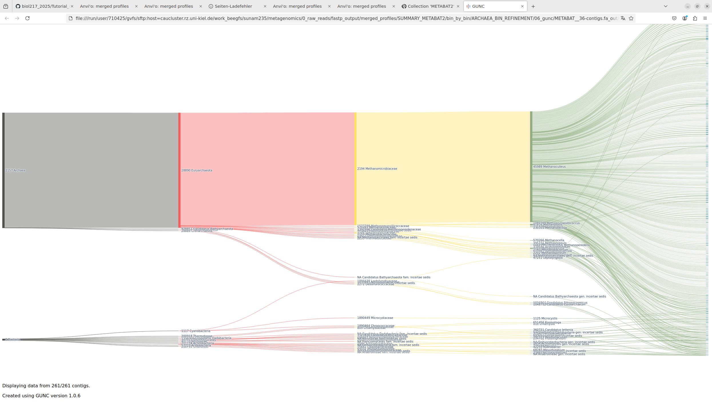
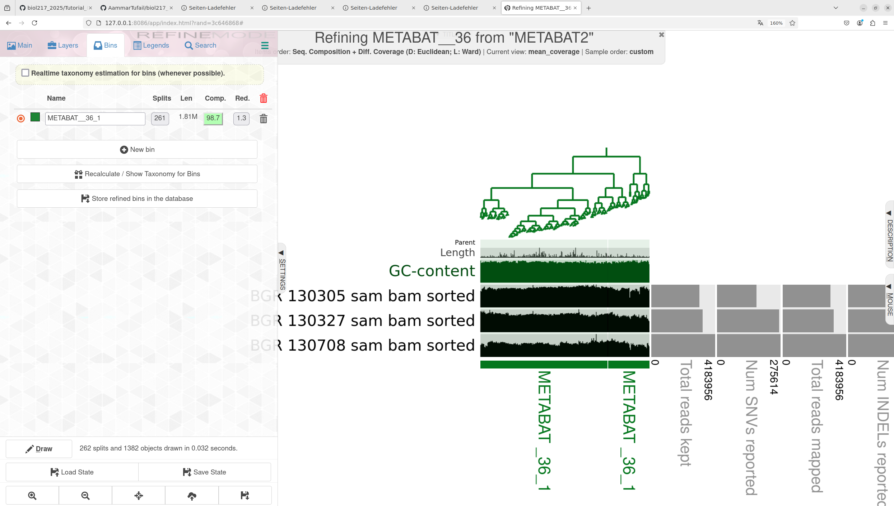

# Protocol Day4
## Mattes Schultze
### 24.01.2025

```bash
anvi-interactive -p /work_beegfs/sunam235/metagenomics/0_raw_reads/fastp_output/merged_profiles/PROFILE.db -c /work_beegfs/sunam235/metagenomics/0_raw_reads/assembly_output/contigs.db -C METABAT2

anvi-interactive -p /work_beegfs/sunam235/metagenomics/0_raw_reads/fastp_output/merged_profiles/PROFILE.db -c /work_beegfs/sunam235/metagenomics/0_raw_reads/assembly_output/contigs.db -C MAXBIN2
```

```bash
anvi-summarize -p /work_beegfs/sunam235/metagenomics/0_raw_reads/fastp_output/merged_profiles/PROFILE.db -c /work_beegfs/sunam235/metagenomics/0_raw_reads/assembly_output/contigs.db --list-collections

anvi-summarize -c /work_beegfs/sunam235/metagenomics/0_raw_reads/assembly_output/contigs.db -p /work_beegfs/sunam235/metagenomics/0_raw_reads/fastp_output/merged_profiles/PROFILE.db -C METABAT2 -o /work_beegfs/sunam235/metagenomics/0_raw_reads/fastp_output/merged_profiles/SUMMARY_METABAT2/just_do_it --just-do-it
```

```bash
cd /work_beegfs/sunam235/metagenomics/0_raw_reads/fastp_output/merged_profiles/SUMMARY_METABAT2/bin_by_bin

mkdir /work_beegfs/sunam235/metagenomics/0_raw_reads/fastp_output/merged_profiles/SUMMARY_METABAT2/bin_by_bin/ARCHAEA_BIN_REFINEMENT

cp /work_beegfs/sunam235/metagenomics/0_raw_reads/fastp_output/merged_profiles/SUMMARY_METABAT2/bin_by_bin/METABAT__36/*.fa /work_beegfs/sunam235/metagenomics/0_raw_reads/fastp_output/merged_profiles/SUMMARY_METABAT2/bin_by_bin/ARCHAEA_BIN_REFINEMENT/

cp /work_beegfs/sunam235/metagenomics/0_raw_reads/fastp_output/merged_profiles/SUMMARY_METABAT2/bin_by_bin/METABAT__9/*.fa /work_beegfs/sunam235/metagenomics/0_raw_reads/fastp_output/merged_profiles/SUMMARY_METABAT2/bin_by_bin/ARCHAEA_BIN_REFINEMENT/

cp /work_beegfs/sunam235/metagenomics/0_raw_reads/fastp_output/merged_profiles/SUMMARY_METABAT2/bin_by_bin/METABAT__35/*.fa /work_beegfs/sunam235/metagenomics/0_raw_reads/fastp_output/merged_profiles/SUMMARY_METABAT2/bin_by_bin/ARCHAEA_BIN_REFINEMENT/
```

```bash
cd /PATH/TO/ARCHAEA_BIN_REFINEMENT

#for i in *.fa; do mkdir /PATH/TO/06_gunc/"$i"_out; done

for i in *.fa; do
  gunc run -i "$i" -r $WORK/databases/gunc/gunc_db_progenomes2.1.dmnd --out_dir /PATH/TO/06_gunc/"$i"_out --threads 8 --detailed_output
done
```




after gunc, evalution:


CSS score 35: 0.0 till genus species 0.1

CSS score 36: 1 till genus species 0.4

CSS score 9: 0.0 till genus species 0.78

A chimeric bin includes contigs from different taxa that don't fit into the rest of the MAG. 

next bin refinement

```bash
anvi-refine -c /work_beegfs/sunam235/metagenomics/0_raw_reads/assembly_output/contigs.db -C METABAT2 -p /work_beegfs/sunam235/metagenomics/0_raw_reads/fastp_output/merged_profiles/PROFILE.db --bin-id METABAT__36

#anvi-refine -c /work_beegfs/sunam235/metagenomics/0_raw_reads/assembly_output/contigs.db -C METABAT2 -p /work_beegfs/sunam235/metagenomics/0_raw_reads/fastp_output/BGR_130305/PROFILE.db /work_beegfs/sunam235/metagenomics/0_raw_reads/fastp_output/BGR_130327/PROFILE.db /work_beegfs/sunam235/metagenomics/0_raw_reads/fastp_output/BGR_130708/PROFILE.db -o /work_beegfs/sunam235/metagenomics/0_raw_reads/fastp_output/merged_profiles --bin-id Bin_METABAT__35

#anvi-refine -c /work_beegfs/sunam235/metagenomics/0_raw_reads/assembly_output/contigs.db -C METABAT2 -p /work_beegfs/sunam235/metagenomics/0_raw_reads/fastp_output/BGR_130305/PROFILE.db /work_beegfs/sunam235/metagenomics/0_raw_reads/fastp_output/BGR_130327/PROFILE.db /work_beegfs/sunam235/metagenomics/0_raw_reads/fastp_output/BGR_130708/PROFILE.db -o /work_beegfs/sunam235/metagenomics/0_raw_reads/fastp_output/merged_profiles --bin-id Bin_METABAT__9
```

completeness of bin 35 and 9 were below 70 % completeness, so only bin 36 was refined

open link to shared server and refine manually, optimal 1.3 redundancy without loss of completeness of 98.7 %



coverage sample 130305 8.22, 130527 5.30, 130708, 3.49