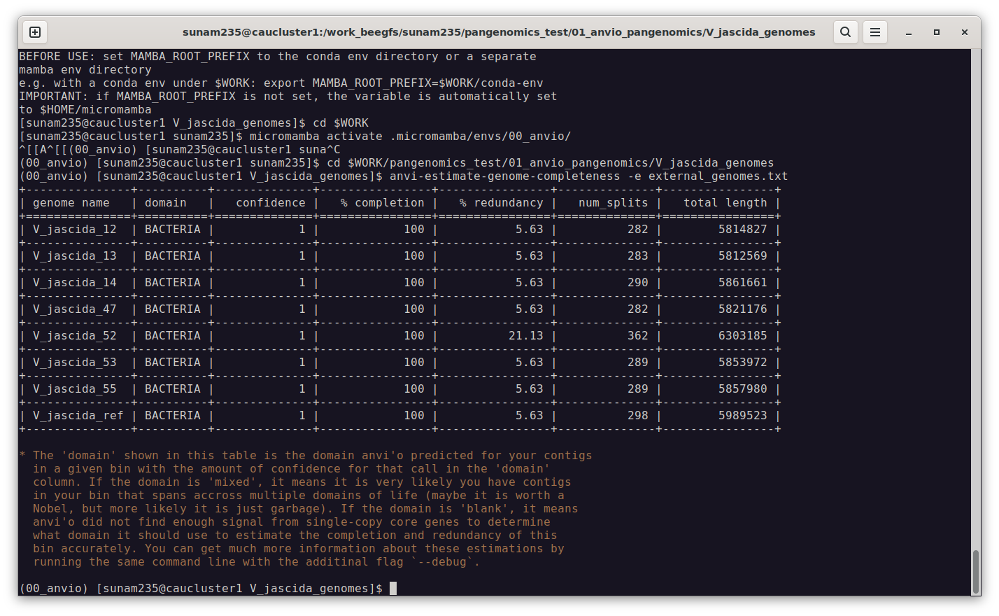
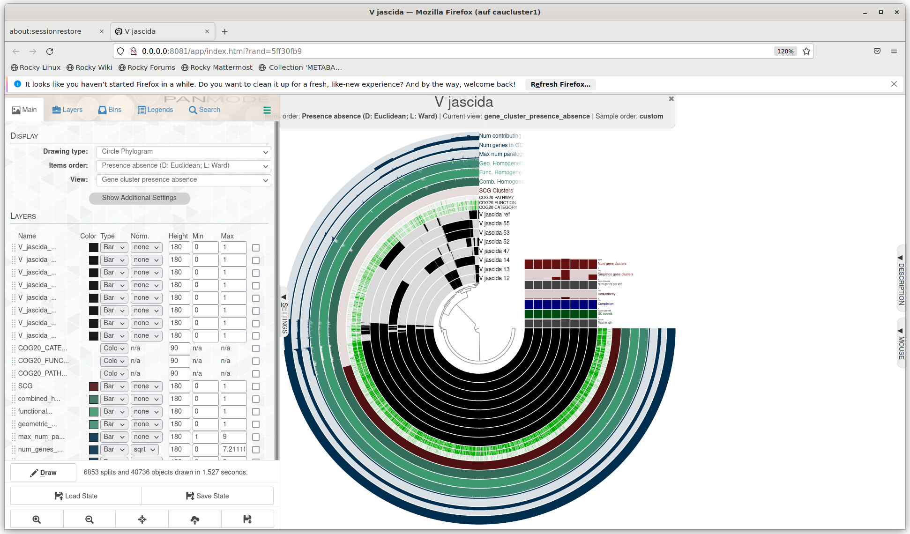
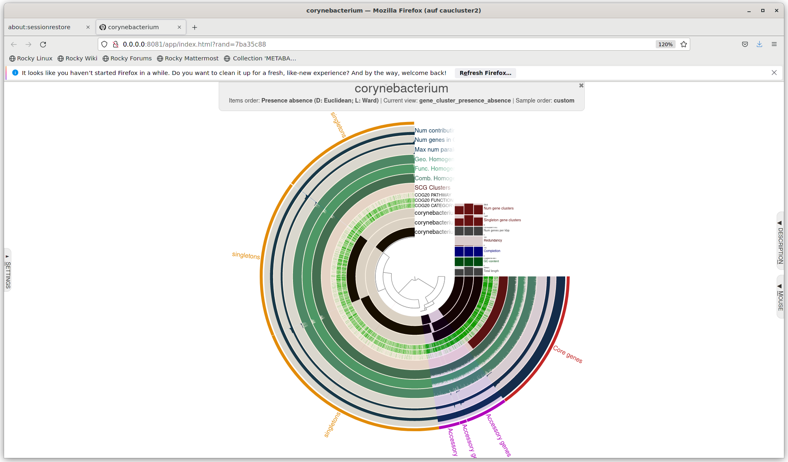
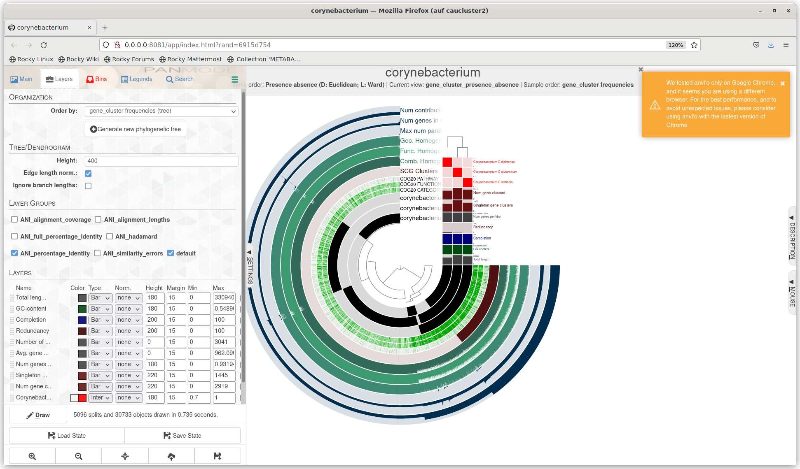

# Protocol Day7
## Mattes Schultze
### 28.01.2025

pangenomics

make directory and download genome from online database

```bash
curl -L https://ndownloader.figshare.com/files/28965090 -o V_jascida_genomes.tar.gz
tar -zxvf V_jascida_genomes.tar.gz
ls V_jascida_genomes
```
create contigs of genomes from fasta files

```bash
#!/bin/bash
#SBATCH --nodes=1
#SBATCH --cpus-per-task=16
#SBATCH --mem=32G
#SBATCH --time=2:00:00
#SBATCH --job-name=anvio_pangenomics
#SBATCH --output=anvio_pangenomics.out
#SBATCH --error=anvio_pangenomics.err
#SBATCH --partition=base
#SBATCH --reservation=biol217

module load gcc12-env/12.1.0
module load micromamba/1.4.2
cd $WORK
$ eval "$(micromamba shell hook --shell=)"
micromamba activate .micromamba/envs/00_anvio/

cd $WORK/pangenomics_test/01_anvio_pangenomics/V_jascida_genomes/

#ls *fasta | awk 'BEGIN{FS="_"}{print $1}' > genomes.txt

#remove all contigs <2500 nt
#for g in `cat genomes.txt`
# do
#     echo
#     echo "Working on $g ..."
#     echo
#     anvi-script-reformat-fasta ${g}_scaffolds.fasta \
#                                --min-len 2500 \
#                                --simplify-names \
#                                -o ${g}_scaffolds_2.5K.fasta
# done

# # generate contigs.db
# for g in `cat genomes.txt`
# do
#     echo
#     echo "Working on $g ..."
#     echo
#     anvi-gen-contigs-database -f ${g}_scaffolds_2.5K.fasta \
#                               -o V_jascida_${g}.db \
#                               --num-threads 4 \
#                               -n V_jascida_${g}
# done

# annotate contigs.db
for g in *.db
do
    anvi-run-hmms -c $g --num-threads 4
    anvi-run-ncbi-cogs -c $g --num-threads 4
    anvi-scan-trnas -c $g --num-threads 4
    anvi-run-scg-taxonomy -c $g --num-threads 4
done

micromamba deactivate
jobinfo

# ##----------------- End -------------
module purge
jobinfo
```

then visualize the contigs with anvio server

```bash
srun --reservation=biol217 --pty --mem=16G --nodes=1 --tasks-per-node=1 --cpus-per-task=1 --partition=base /bin/bash
module load gcc12-env/12.1.0
module load miniconda3/4.12.0
module load micromamba/1.4.2
eval "$(micromamba shell hook --shell=bash)"
cd $WORK
micromamba activate .micromamba/envs/00_anvio/
anvi-display-contigs-stats $WORK/pangenomics_test/01_anvio_pangenomics/V_jascida_genomes/*db
```

create external genome file

```bash
cd $WORK/pangenomics_test/01_anvio_pangenomics/V_jascida_genomes/

anvi-script-gen-genomes-file --input-dir $WORK/pangenomics_test/01_anvio_pangenomics/V_jascida_genomes/ -o external_genomes.txt
```

contamination seen in terminal: 



extra: 
```bash
#!/bin/bash
#SBATCH --job-name=day7_52
#SBATCH --output=day7_52.out
#SBATCH --error=dday7_52.err
#SBATCH --nodes=1
#SBATCH --ntasks-per-node=1
#SBATCH --cpus-per-task=12
#SBATCH --mem=25G
#SBATCH --partition=base
#SBATCH --time=1:30:00
#SBATCH --reservation=biol217

module load gcc12-env/12.1.0
module load miniconda3/4.12.0
module load micromamba/1.4.2
eval "$(micromamba shell hook --shell=bash)"
cd $WORK
micromamba activate .micromamba/envs/00_anvio/

cd $WORK/pangenomics_test/01_anvio_pangenomics/V_jascida_genomes/

anvi-profile -c $WORK/pangenomics_test/01_anvio_pangenomics/V_jascida_genomes/V_jascida_52.db \
             --sample-name V_jascida_52 \
             --output-dir V_jascida_52_dir \
             --blank

micromamba deactivate
jobinfo

# ##----------------- End -------------
module purge
jobinfo
```

then, compute genomes with anvi gen

```bash
#!/bin/bash
#SBATCH --job-name=day7_compute_5
#SBATCH --output=day7_compute_5.out
#SBATCH --error=day7_compute_5.err
#SBATCH --nodes=1
#SBATCH --ntasks-per-node=1
#SBATCH --cpus-per-task=12
#SBATCH --mem=25G
#SBATCH --partition=base
#SBATCH --time=1:30:00
#SBATCH --reservation=biol217

module load gcc12-env/12.1.0
module load miniconda3/4.12.0
module load micromamba/1.4.2
eval "$(micromamba shell hook --shell=bash)"
cd $WORK
micromamba activate .micromamba/envs/00_anvio/

cd $WORK/pangenomics_test/01_anvio_pangenomics/V_jascida_genomes/

anvi-gen-genomes-storage -e external_genomes.txt \
                         -o V_jascida_GENOMES.db

anvi-pan-genome -g V_jascida_GENOMES.db \
                --project-name V_jascida \
                --num-threads 4        

micromamba deactivate
jobinfo

# ##----------------- End -------------
module purge
jobinfo
```

then, the pangenome can be displayed with anvi-display, which opens the pangenome directly in the browser

```bash
srun --pty --mem=10G --nodes=1 --tasks-per-node=1 --cpus-per-task=1 --partition=base /bin/bash

module load gcc12-env/12.1.0
module load micromamba/1.4.2
cd $WORK
micromamba activate .micromamba/envs/00_anvio/

cd $WORK/pangenomics_test/01_anvio_pangenomics/V_jascida_genomes/

anvi-display-pan -p V_jascida/V_jascida-PAN.db -g V_jascida_GENOMES.db
```

resulting graph:



read interactive interface anvio 101

do your own genomes now: 

```bash
#!/bin/bash
#SBATCH --nodes=1
#SBATCH --cpus-per-task=16
#SBATCH --mem=32G
#SBATCH --time=2:00:00
#SBATCH --job-name=anvio_coryne
#SBATCH --output=anvio_coryne.out
#SBATCH --error=anvio_coryne.err
#SBATCH --partition=base
#SBATCH --reservation=biol217


module load gcc12-env/12.1.0
module load micromamba/1.4.2
eval "$(micromamba shell hook --shell=bash)"
cd $WORK
micromamba activate .micromamba/envs/00_anvio/

# go to your folder where you have all the genomes
cd $WORK/pangenomics_test/01_anvio_pangenomics/corynebacterium

# #wget https://ftp.ncbi.nlm.nih.gov/genomes/all/GCF/001/941/345/GCF_001941345.1_ASM194134v1/GCF_001941345.1_ASM194134v1_genomic.fna.gz stationis
# #wget https://ftp.ncbi.nlm.nih.gov/genomes/all/GCF/000/011/325/GCF_000011325.1_ASM1132v1/GCF_000011325.1_ASM1132v1_genomic.fna.gz glutamicum
# #wget https://ftp.ncbi.nlm.nih.gov/genomes/all/GCF/001/457/455/GCF_001457455.1_NCTC11397/GCF_001457455.1_NCTC11397_genomic.fna.gz diphtheriae

# #1- rename files
# for file in *.fna; do mv "$file" "${file%.fna}.fasta"; done

# #2- Fast files to contigs DBs
# #put genome into text file to make for loop
# ls *fasta | awk 'BEGIN{FS="."}{print $1}' > genomes.txt
# # reformat fasta files
# for g in `cat genomes.txt`
# do
#     echo
#     echo "Working on $g ..."
#     echo
#     anvi-script-reformat-fasta ${g}.fasta \
#                                --min-len 2500 \
#                                --simplify-names \
#                                -o ${g}_2.5K.fasta
# done

# # # Get the number of CPU cores

name="corynebacterium"

# #convert into contigs dbs
# for g in `cat genomes.txt`
# do
#     echo
#     echo "Working on $g ..." 
#     echo
#     anvi-gen-contigs-database -f ${g}_2.5K.fasta \
#                               -o ${name}_${g}.db \
#                               --num-threads 12 \
#                               -n ${name}_${g}
# done


# #3- annotating contigs db
# for g in *.db
# do
#     anvi-run-hmms -c $g --num-threads 12
#     anvi-run-ncbi-cogs -c $g --num-threads 12
#     anvi-scan-trnas -c $g --num-threads 12
#     anvi-run-scg-taxonomy -c $g --num-threads 12
# done

#4- creating an external genome file
anvi-script-gen-genomes-file --input-dir $WORK/pangenomics_test/01_anvio_pangenomics/corynebacterium \
                             -o external-genomes.txt

#5- Estimating contamination

cd $WORK/pangenomics_test/01_anvio_pangenomics/corynebacterium
anvi-estimate-genome-completeness -e external-genomes.txt
# check if refinement needed or turn off this

#6- computing a pangenome
anvi-gen-genomes-storage -e external-genomes.txt \
                         -o ${name}-GENOMES.db

anvi-pan-genome -g ${name}-GENOMES.db \
                --project-name ${name} \
                --num-threads 12

#7- calculating average nucleotide identity ANI
anvi-compute-genome-similarity --external-genomes external-genomes.txt \
                               --program pyANI \
                               --output-dir ANI \
                               --num-threads 12 \
                               --pan-db ${name}/${name}-PAN.db 


#8- phylogenomic tree
anvi-get-sequences-for-gene-clusters -p ${name}/${name}-PAN.db \
                                     -g ${name}-GENOMES.db \
                                     --min-num-genomes-gene-cluster-occurs 3 \
                                     --max-num-genes-from-each-genome 1 \
                                     --concatenate-gene-clusters \
                                     --output-file ${name}/${name}-SCGs.fa

trimal -in ${name}/${name}-SCGs.fa \
         -out ${name}/${name}-SCGs-clean.fa \
         -gt 0.5

iqtree -s ${name}/${name}-SCGs-clean.fa \
       -m WAG \
       -bb 1000 \
       -nt $threads

micromamba deactivate
jobinfo

# ##----------------- End -------------
module purge
jobinfo
```

visualize: 
```bash
module load gcc12-env/12.1.0
module load micromamba/1.4.2
eval "$(micromamba shell hook --shell=bash)"
cd $WORK
micromamba activate .micromamba/envs/00_anvio/

cd $WORK/pangenomics_test/01_anvio_pangenomics/corynebacterium/

anvi-display-pan -p corynebacterium/corynebacterium-PAN.db -g corynebacterium-GENOMES.db
```

result:



total: 5096
data: core genes: 1019, SCCGs: 965, singletons: 3556, accessory genes: 498

tree with ani:

